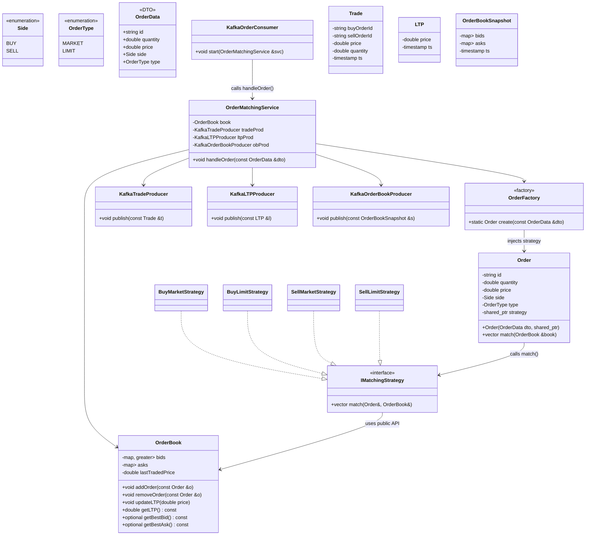

# Matcher Engine

## Build and Run with Docker Compose

1. **Ensure Docker and Docker Compose are installed.**
2. From the MatchingEngineroot, run:

```sh
docker-compose up --build
```

- This will build and start MatchingEngineas defined in the `docker-compose.yml` files.
- To stop the services:

```sh
docker-compose down
```

## Local Development (macOS/Linux)

1. **Install dependencies:**

   - C++ compiler (e.g., clang++)
   - CMake
   - [librdkafka](https://github.com/edenhill/librdkafka)
   - [cppkafka](https://github.com/mfontanini/cppkafka)
   - nlohmann/json (header-only)

2. **Build the matchingEngine:**

```sh
cd MatchingEngine
make
```

- The executable `MatchingEngine` will be created in the `MatchingEngine` directory.

- **Run Kafka and Zookeeper (if not using Docker Compose):**

  - Start Zookeeper and Kafka brokers as required.

- **Run the matchingEngine:**

```sh
./MatchingEngine
```

## Class Diagram (Mermaid)



---

- For more details, see the source code in the `MatchingEngine` directory.
