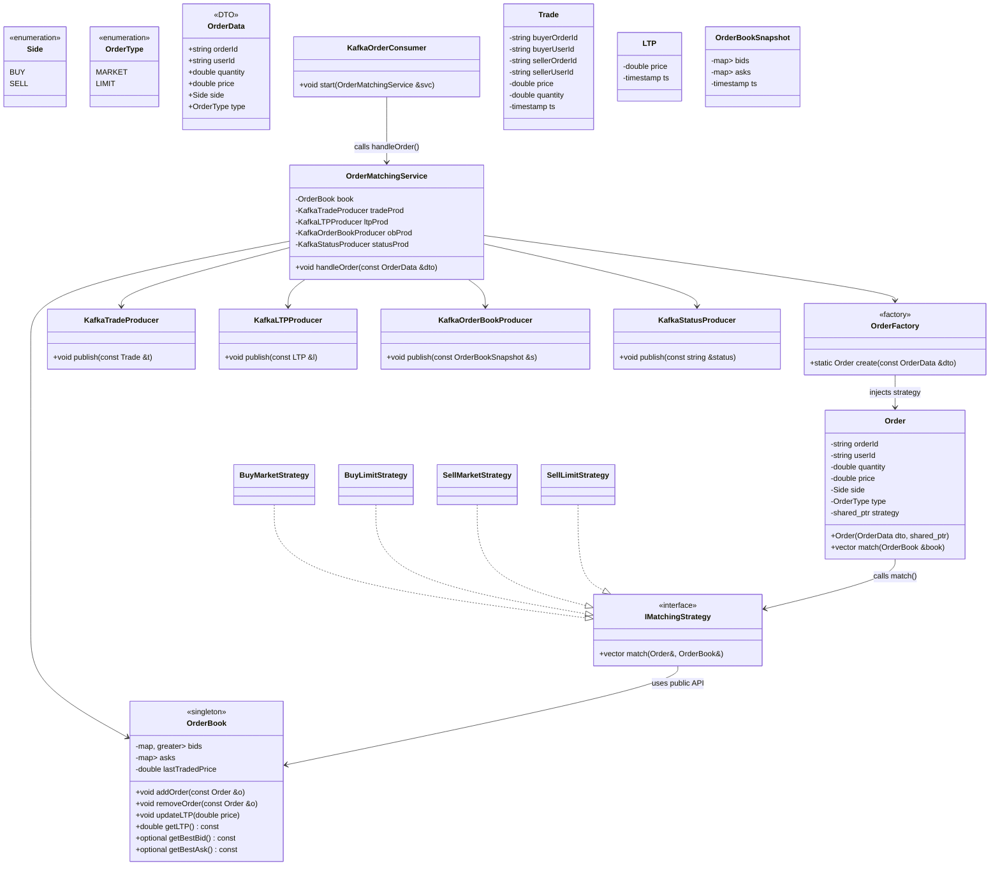
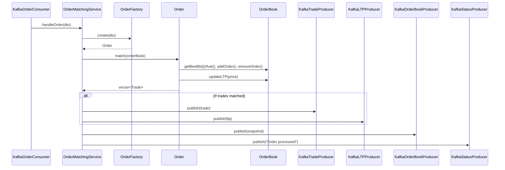
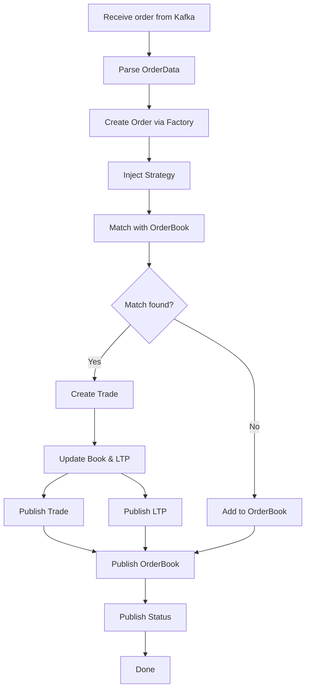
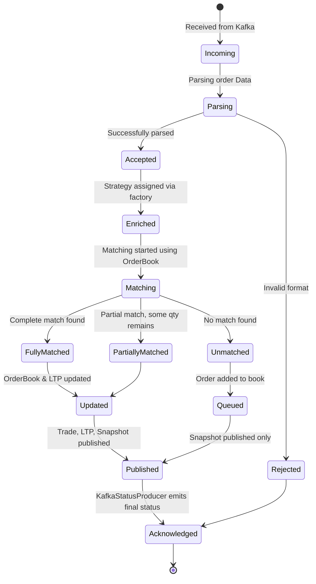

# 💹 Real-Time Trading System

A **microservices-based trading platform** built for **scalability and high performance**.
It features a modern ReactJS frontend, a Spring Boot backend API, a high-speed C++ matching engine, and uses Apache Kafka for real-time event streaming. All components are containerized with Docker and orchestrated via Kubernetes.

---

## 🧭 Table of Contents

- [Architecture Overview](#-architecture-overview)
- [Technologies Used](#-technologies-used)
- [Prerequisites](#-prerequisites)
- [Getting Started](#-getting-started)
- [Local Development](#-local-development-with-docker-compose)
- [Kubernetes Deployment](#️-kubernetes-deployment)
- [Matching Engine UML Diagrams](#-matching-engine-uml-diagrams)
- [License](#-license)

---

## 🧱 Architecture Overview

- 🖥️ **Frontend** (ReactJS)
  User interface for placing and tracking trades.

- 🔙 **Backend API** (Spring Boot)
  REST API server for order validation and coordination.

- ⚙️ **Matcher Engine** (C++17)
  High-performance engine to match buy/sell orders in real-time.

- 🔁 **Messaging** (Apache Kafka + Zookeeper)
  Decouples services and handles real-time order streaming.

- 🐳 **Containers** (Docker) & ☸️ **Orchestration** (Kubernetes)

---

## 🚀 Technologies Used

| Layer              | Technology        |
| ------------------ | ----------------- |
| 🖼️ Frontend        | ReactJS, NGINX    |
| 🔙 Backend         | Spring Boot, Java |
| ⚙️ Matching Engine | C++17             |
| 📬 Messaging       | Apache Kafka      |
| 🧠 Coordination    | Zookeeper         |
| 🐳 Containers      | Docker            |
| ☸️ Orchestration   | Kubernetes        |

---

## ⚙️ Prerequisites

- Docker ≥ 20.10
- Docker Compose ≥ 1.29
- Java 17+
- Node.js ≥ 16
- A C++20 compatible compiler (e.g., `g++-10` or later)
- kubectl ≥ 1.23
- A running Kubernetes cluster (Minikube, Kind, EKS, etc.)

---

## 🛠️ Getting Started

Clone the repository:

```bash
git clone https://github.com/jaspreetG/Gold-commodity-exchange.git
cd Gold-commodity-exchange
```

---

## 🧪 Local Development with Docker Compose

To build and start all services for local development:

```bash
docker-compose up --build
```

To stop the stack:

```bash
docker-compose down
```

---

## ☸️ Kubernetes Deployment

Deploy all services to your Kubernetes cluster:

```bash
kubectl apply -f k8s/
```

Ensure Kafka, Zookeeper, and other services are properly set up and the cluster is running.

---

## 📄 License

Licensed under the [MIT License](./LICENSE).

---

## 🔧Matching Engine UML Diagrams

This section provides visual representation of the matching engine internals using UML diagrams to help understand design structure, interactions, and order lifecycle.

### 📘 Class Diagram

Structure of core classes in the matching engine.



---

### 🔁 Sequence Diagram

Flow of order processing from Kafka input to trade publication.



---

🔄 Activity Diagram

Visual flow of logic during order processing.



---

🔀 State Transition Diagram

Lifecycle states of an order during processing.


