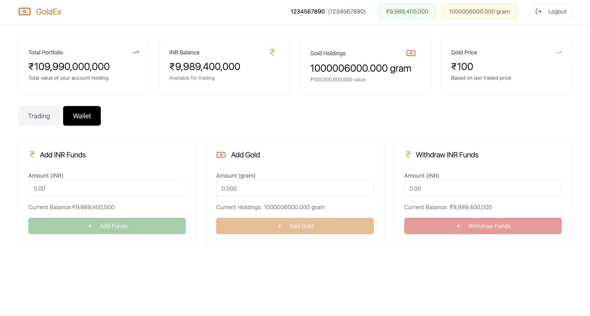
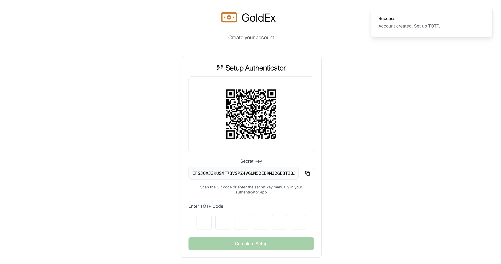
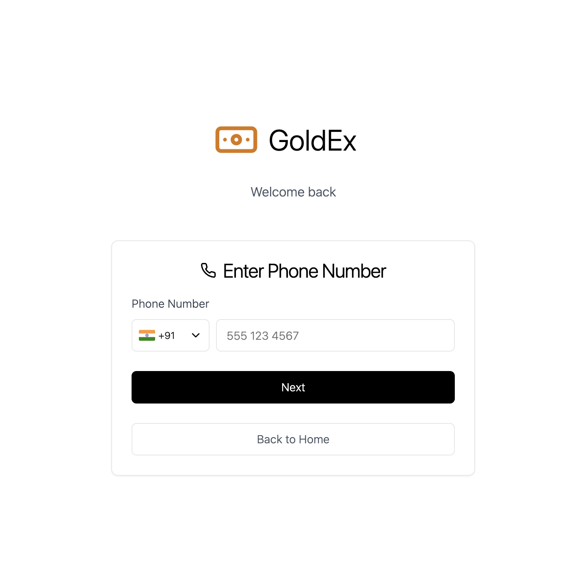
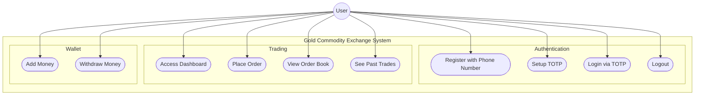

# 💹 Real-Time Trading System

A **microservices-based trading platform** built for **scalability and high performance**.  
It features a modern ReactJS frontend, a Spring Boot backend API, a high-speed C++ matching engine, and uses Apache Kafka for real-time event streaming. All components are containerized with Docker and orchestrated via Kubernetes.

## Gold Commodity Exchange 🪙

Live demo in GitHub Codespaces:

[](https://github.com/codespaces/new?hide_repo_select=true&repo=JaspreetG/Gold-commodity-exchange&ref=main)

> 💡 When the Codespace opens, it auto-runs all services via Docker Compose. The frontend runs on port **3000**. Use the “Ports” tab to open the live site.
>  >  >  >  >  >  >  >  >  > 

## Table of Contents

- [🧱 Architecture Overview](#architecture-overview)
- [🚀 Technologies Used](#technologies-used)
- [⚙️ Prerequisites](#prerequisites)
- [🛠️ Getting Started](#getting-started)
- [🧪 Local Development with Docker Compose](#local-development-with-docker-compose)
- [☸️ Kubernetes Deployment](#kubernetes-deployment)
- [🖥️ Deployment Diagram](#deployment-diagram)
- [🧩 Spring Boot UML Diagrams](#spring-boot-uml-diagrams)
- [🔧 Matching Engine UML Diagrams](#matching-engine-uml-diagrams)
- [📄 License](#license)

---

## Architecture Overview

- 🖥️ **Frontend** (ReactJS)  
  User interface for placing and tracking trades.

- 🔙 **Backend API** (Spring Boot)  
  REST API server for order validation and coordination.

- 🔌 **WebSocket Communication** (Spring WebSocket)  
  Enables real-time updates like order book, LTP, and trades to clients.

- ⚙️ **Matcher Engine** (C++17)  
  High-performance engine to match buy/sell orders in real-time.

- 📬 **Messaging** (Apache Kafka + Zookeeper)  
  Decouples services and handles real-time order streaming.

- 🗄️ **Database** (PostgreSQL)  
  Stores user data, wallet balances, and trade history.

- 🐳 **Containers** (Docker) & ☸️ **Orchestration** (Kubernetes)

---

## Technologies Used

| Layer              | Technology        |
| ------------------ | ----------------- |
| 🖼️ Frontend        | ReactJS, NGINX    |
| 🔙 Backend         | Spring Boot, Java |
| 🔌 WebSocket       | Spring WebSocket  |
| ⚙️ Matching Engine | C++17             |
| 📬 Messaging       | Apache Kafka      |
| 🧠 Coordination    | Zookeeper         |
| 🗄️ Database        | PostgreSQL        |
| 🐳 Containers      | Docker            |
| ☸️ Orchestration   | Kubernetes        |

---

## Prerequisites

- Docker ≥ 20.10
- Docker Compose ≥ 1.29
- Java 17+
- Node.js ≥ 16
- A C++20 compatible compiler (e.g., `g++-10` or later)
- kubectl ≥ 1.23
- A running Kubernetes cluster (Minikube, Kind, EKS, etc.)

---

## Getting Started

Clone the repository:

```bash
git clone https://github.com/jaspreetG/Gold-commodity-exchange.git
cd Gold-commodity-exchange
```

---

## Local Development with Docker Compose

To build and start all services for local development:

```bash
docker-compose up --build
```

To stop the stack:

```bash
docker-compose down
```

---

## Kubernetes Deployment

Deploy all services to your Kubernetes cluster:

```bash
kubectl apply -f k8s/
```

Ensure Kafka, Zookeeper, and other services are properly set up and the cluster is running.

---

## Deployment Diagram

This section shows how the system is deployed across containers, services, and infrastructure — highlighting interactions between Kafka, backend services, and other components.


---

## Spring Boot UML Diagrams

This section visualizes the internal architecture and flow of the Spring Boot services using various UML diagrams.

---

### 🎯 Use Case Diagram

High-level representation of how different users (like Admin, Trader) interact with the system.



---

### 📘 Class Diagram

Structure of key Spring Boot components: controllers, services, repositories, models.


---

### 🔁 Sequence Diagram


---

### 🔄 Activity Diagram

Visualizes logic flow (e.g., registration, order handling, etc.).


---

## Matching Engine UML Diagrams

This section provides visual representation of the matching engine internals using UML diagrams to help understand design structure, interactions, and order lifecycle.

### Class Diagram

Structure of core classes in the matching engine.


---

### Sequence Diagram

Flow of order processing from Kafka input to trade publication.


---

### Activity Diagram

Visual flow of logic during order processing.


---

### State Transition Diagram

Lifecycle states of an order during processing.


## License

Licensed under the [MIT License](./LICENSE).

---
